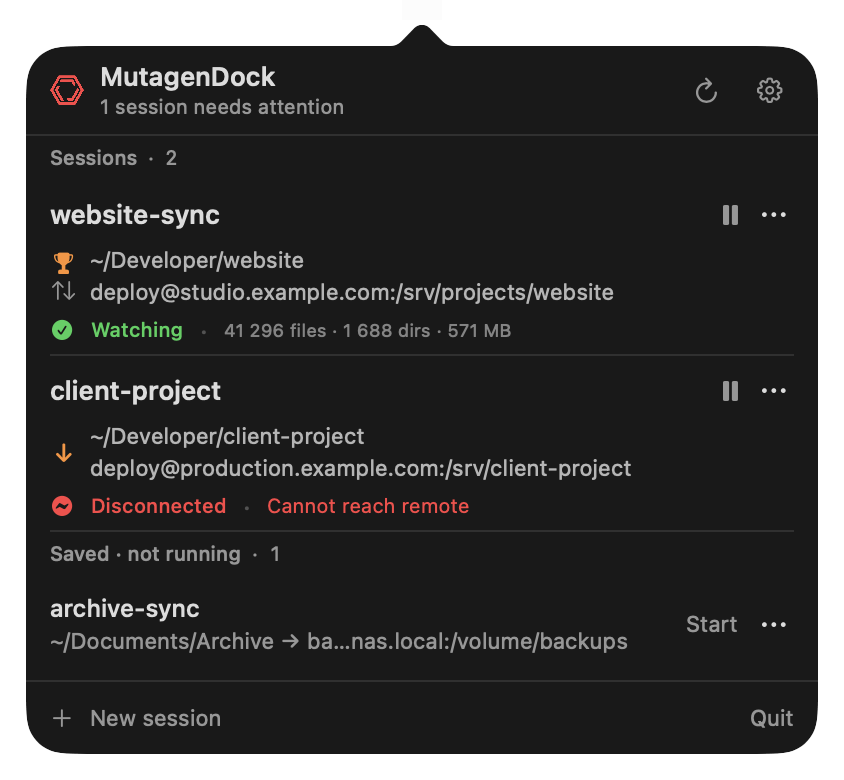

<p align="center">
  
</p>

<h1 align="center">MutagenDock</h1>

<p align="center">
  <strong>Folder sync, quietly in your menu bar.</strong><br>
  A compact, native macOS companion for <a href="https://mutagen.io/">Mutagen</a>.
</p>

<p align="center">
  macOS 14+ &nbsp;·&nbsp; SwiftUI &nbsp;·&nbsp; Powered by the Mutagen CLI
</p>

<p align="center">
  <a href="#installation">Installation</a> &nbsp;·&nbsp;
  <a href="#usage">Usage</a> &nbsp;·&nbsp;
  <a href="#development">Development</a>
</p>

<p align="center">
  
</p>

See which folders are syncing, pause or resume a session, and spot connection
problems without opening a terminal. MutagenDock puts a small interface over
the `mutagen` CLI; Mutagen handles the actual synchronization.

## At a glance

- **Live status.** Paths, sync direction, file counts, and connection health in a compact panel. The menu bar icon turns red when a session needs attention.
- **Quick controls.** Pause and resume inline. Use `⋯` to force a sync cycle, reveal a folder, copy paths, edit, reset history, or terminate a session.
- **Flexible targets.** Connect a local folder to an SSH server, another local folder, or a custom Mutagen URL.
- **Your sync rules.** Choose two-way or one-way sync, decide how conflicts are handled, and exclude version-control folders, build output, or custom patterns.
- **Remembered sessions.** Created sessions and discovered definitions are saved locally. A terminated session can be started again from **Saved · not running**.
- **Native and unobtrusive.** Light and dark appearances, no Dock icon, configurable refresh intervals, and optional daemon startup on launch.

## Screenshots

<table>
  <tr>
    <th>Create a session</th>
    <th>Settings</th>
  </tr>
  <tr>
    <td>
      <picture>
        <source media="(prefers-color-scheme: dark)" srcset="docs/images/new-session-dark.png">
        
      </picture>
    </td>
    <td>
      <picture>
        <source media="(prefers-color-scheme: dark)" srcset="docs/images/settings-dark.png">
        
      </picture>
    </td>
  </tr>
</table>

*Screenshots use example sessions, not live connections. The icon above is the
same app icon used in Spotlight and Finder.*

## Installation

### Requirements

- **macOS 14 or newer.**
- **[Mutagen](https://mutagen.io/documentation/introduction/installation/)** installed separately.
- **Xcode Command Line Tools** with Swift 5.9 or newer to build from source.
- Working **SSH access** for remote targets. Check that you can connect with `ssh` first.

### Homebrew (planned)

Homebrew distribution is planned. The install command will be added here once
the release pipeline and formula are published. For now, build from source below.

### Build from source

Install Mutagen with [Homebrew](https://brew.sh/):

```sh
brew install mutagen
```

If you haven't installed Apple's command line tools, run `xcode-select --install`.
Then clone the project and build the app:

```sh
git clone https://github.com/dylbertram/mutagen-dock-ui.git
cd mutagen-dock-ui
./scripts/build-app.sh
open build/MutagenDock.app
```

The app opens directly in the **menu bar**, not the Dock.

To build, install to `/Applications`, and launch instead:

```sh
./scripts/install.sh
```

The install script replaces an existing `/Applications/MutagenDock.app` and
restarts the app. Once installed, search for **Mutagen Dock** in Spotlight.

## Usage

1. **Open the panel.** Click the menu bar icon. Existing Mutagen sessions appear automatically.
2. **Add folders.** Choose **New session**, enter a name and local folder, then choose an SSH target, local folder, or custom URL.
3. **Choose a mode.** Two-way safe sync is the default. Read the explanation before choosing automatic conflict resolution or one-way replica.
4. **Set exclusions.** Toggle version-control folders or build output. Click the **Additional ignore patterns** row to enter patterns, one per line.
5. **Create the session.** MutagenDock starts it and remembers its definition.

Click **pause** to pause a session or **play** to resume it. The `⋯` menu contains
the less-frequent actions. **Terminate** removes the Mutagen session but keeps
its saved definition; **Start** recreates it. **Forget definition** removes only
the saved entry.

The arrows show how changes flow between the displayed endpoints. A **trophy**
marks the side that wins conflicts in two-way resolved mode. An **orange arrow**
indicates one-way replica mode, which can overwrite or delete target files.

Right-click or Control-click the menu bar icon for **New session**, **Open**, and
**Quit**. Quitting MutagenDock does **not** stop Mutagen's daemon or your sync sessions.

## Settings & troubleshooting

Open the **gear** icon to change the refresh interval (1–15 seconds), show or hide
the session count, choose whether to start the daemon on launch, or override the
`mutagen` executable path.

- **Mutagen not found?** Install it, or set its path in Settings. Common Homebrew locations and your login shell are checked automatically.
- **Daemon not running?** Click **Start daemon** in the panel or Settings.
- **Remote disconnected?** Check the host, network connection, and SSH authentication. Confirm the connection works from your terminal, then refresh the panel.

## Important notes

- **Mutagen is required.** This app is a front-end, not a replacement for Mutagen or SSH.
- **Editing recreates a session.** Mutagen has no in-place edit operation, so saving changes terminates and recreates the session. Files stay in place.
- **Conflicts need attention.** Status errors are shown, but there is no built-in conflict resolver.
- **Imported definitions are best-effort.** Review the sync mode, ignore rules, and SSH port before restarting or editing a session discovered from the CLI. Automatically reconstructed SSH targets do not retain a custom port.
- **Saved definitions are not backups.** Settings and definitions are stored locally in `UserDefaults`; Mutagen owns the running sessions and synchronization history.

## Development

The project uses Swift Package Manager, AppKit for the menu bar/popover, and
SwiftUI for the interface. `MutagenClient` wraps CLI commands; `AppStore` handles
polling, actions, and local persistence.

```sh
swift build
swift test
```

Render isolated light/dark UI fixtures without starting Mutagen or changing
your sessions:

```sh
bash scripts/preview-ui.sh
```

Images are written to `.report/ui-refinement/`. For documentation-ready examples,
pass `--public`; add `--native` to capture the real popover, including its arrow:

```sh
bash scripts/preview-ui.sh .report/readme --public --native
```

Native capture requires screen-recording permission and briefly shows fixture
popovers. Public README images live in [`docs/images`](docs/images); the app icon
is [`Resources/AppIcon-1024.png`](Resources/AppIcon-1024.png).
