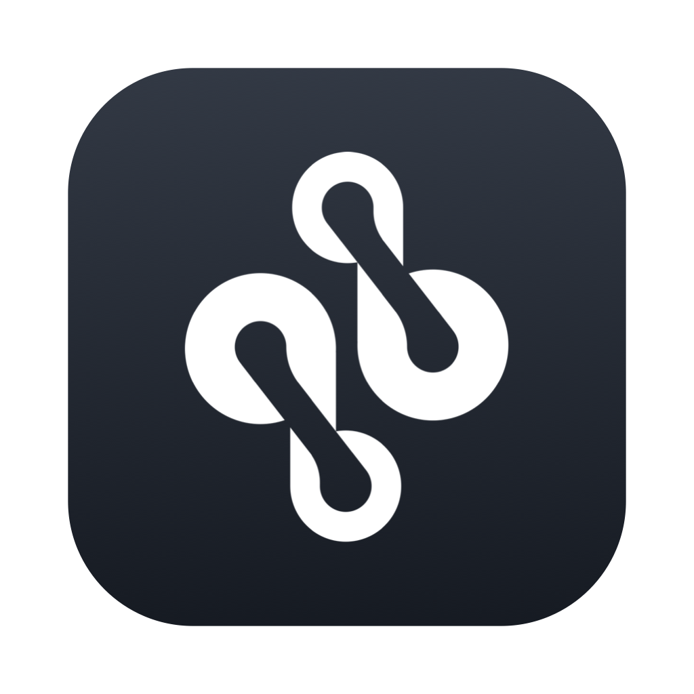
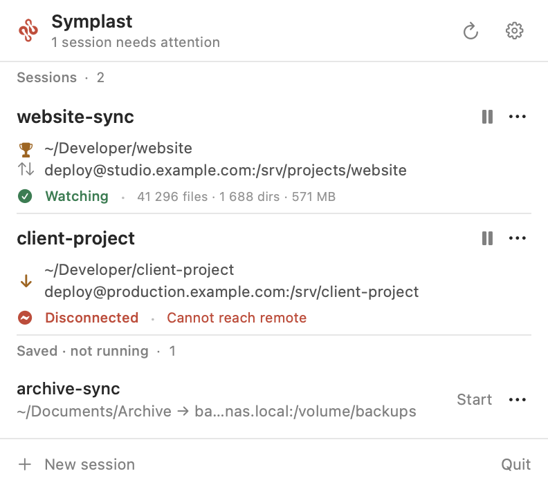
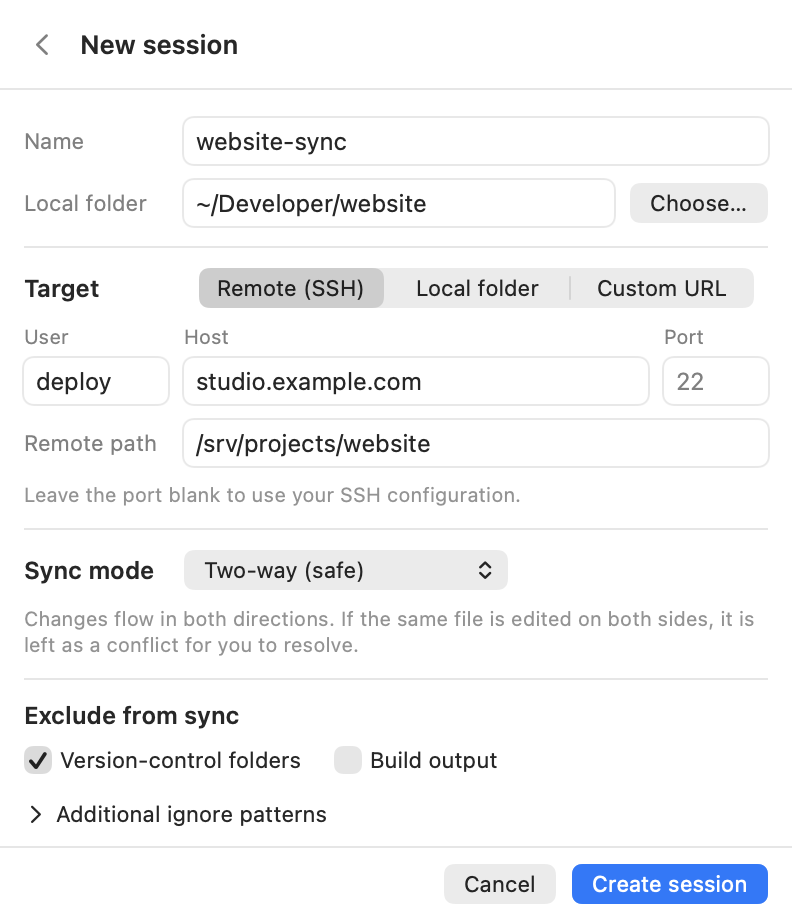
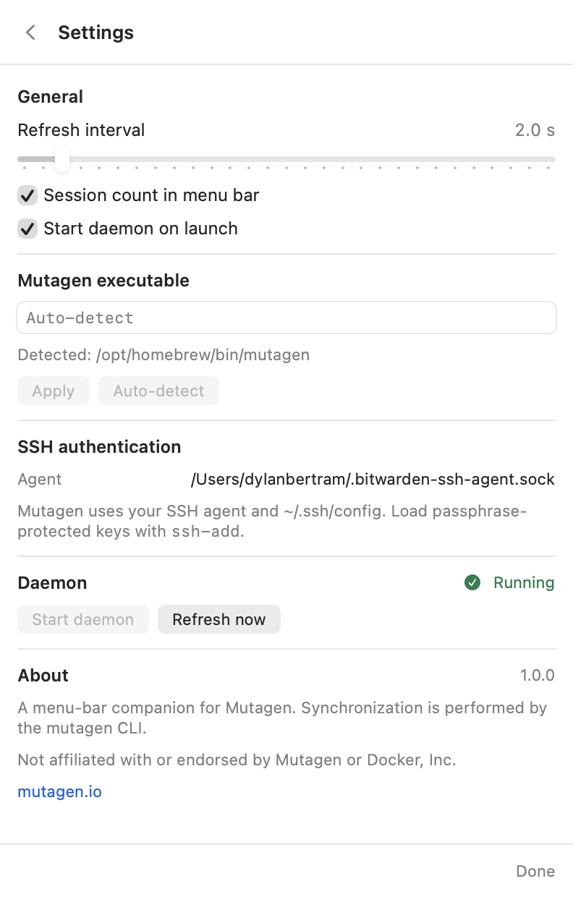

<p align="center">
  
</p>

<h1 align="center">Symplast</h1>

<p align="center">
  <strong>Folder sync, quietly in your menu bar.</strong><br>
  A native macOS companion for <a href="https://mutagen.io/">Mutagen</a>.
</p>

<p align="center">
  macOS 14+ &nbsp;·&nbsp; Apple Silicon &amp; Intel &nbsp;·&nbsp; SwiftUI
</p>

<p align="center">
  <a href="https://symplast.app">Website</a> &nbsp;·&nbsp;
  <a href="#installation">Installation</a> &nbsp;·&nbsp;
  <a href="docs/usage.md">Usage guide</a> &nbsp;·&nbsp;
  <a href="docs/building.md">Build from source</a>
</p>

<p align="center">
  <picture>
    <source media="(prefers-color-scheme: dark)" srcset="docs/images/sessions-dark.png">
    
  </picture>
</p>

See which folders are syncing, pause or resume a session, and spot connection
problems without opening a terminal. Symplast is a small interface over the
Mutagen CLI; Mutagen handles the actual synchronization.

## Features

- **Live status.** Paths, sync direction, file counts, and connection health. The menu bar icon turns red when a session needs attention.
- **Quick controls.** Pause, resume, force a sync cycle, reveal folders, copy paths, edit, reset history, or terminate sessions.
- **Flexible targets.** Sync to an SSH server, another local folder, or a custom Mutagen URL.
- **Your sync rules.** Two-way or one-way modes, conflict behavior, and ignore patterns.
- **Remembered sessions.** Restart saved definitions after terminating their live sessions.
- **Native and unobtrusive.** Light and dark appearances, no Dock icon, and configurable refresh intervals.

## Installation

Requires **macOS 14 Sonoma or newer**. Release disk images support both Apple
Silicon and Intel Macs.

### Download

Find published downloads on [GitHub Releases](https://github.com/dylbertram/symplast/releases).
If no release is listed yet, use the [source build guide](docs/building.md).

- **With Mutagen: `Symplast-<version>-bundled.dmg`** — recommended easy install;
  everything needed for synchronization is included. No terminal setup required.
- **Without Mutagen: `Symplast-<version>.dmg`** — smaller app-only download;
  use your existing Mutagen installation or install it separately.

Open the disk image, drag **Symplast** to **Applications**, and launch it from
Applications or Spotlight. Look for its icon in the **menu bar**, not the Dock.

> Public releases are intended to be **Developer ID signed and notarized**;
> check the release notes for the artifact's status. Development/ad-hoc builds
> can be blocked by macOS. Do not disable Gatekeeper. See the
> [installation guide](docs/installation.md) for checksums, first-launch help,
> and uninstall instructions.

### Homebrew

The release pipeline prepares a cask for the `dylbertram/symplast` tap.
**Once the public tap is activated**, install the self-contained app with:

```sh
brew install --cask dylbertram/symplast/symplast
```

This is a third-party tap, not Homebrew's official cask collection. Homebrew
installation does not bypass macOS security checks.

## Usage

1. Click the menu bar icon. Existing Mutagen sessions appear automatically.
2. Choose **New session**, name it, and select a local folder and target.
3. Choose a sync mode. Two-way safe is the default; review the warning before using one-way replica.
4. Add exclusions for version-control folders, build output, or custom patterns.
5. Create the session. Symplast starts it and remembers the definition.

Use **pause** or **play** inline; the `⋯` menu holds the other actions.
**Terminate** removes a live session but keeps its saved definition. **Start**
recreates it; **Forget definition** removes only the saved entry.

A **trophy** marks the side that wins conflicts in two-way resolved mode. An
**orange arrow** identifies one-way replica mode, which can overwrite or delete
target files. Quitting Symplast does **not** stop Mutagen or its running sessions.

## Screenshots

<table>
  <tr><th>Create a session</th><th>Settings</th></tr>
  <tr>
    <td><picture>
      <source media="(prefers-color-scheme: dark)" srcset="docs/images/new-session-dark.png">
      
    </picture></td>
    <td><picture>
      <source media="(prefers-color-scheme: dark)" srcset="docs/images/settings-dark.png">
      
    </picture></td>
  </tr>
</table>

Screenshots use example sessions, not live connections.

## Help & limitations

- **SSH:** use your SSH configuration and an unlocked key in your agent. Password/passphrase prompting is not supported. Failed authentication stops retries until you fix your credentials and resume. See [SSH authentication](docs/authentication.md).
- **Mutagen not found:** use the bundled app, install Mutagen separately, or set its path in Settings.
- **Editing recreates a session.** Files remain in place, but Mutagen has no in-place edit operation.
- **Imported definitions are best-effort.** Review mode, ignores, and SSH port before recreating a session imported from the CLI; reconstructed SSH targets do not retain custom ports.
- **Saved definitions are not backups.** Symplast stores settings locally; Mutagen owns synchronization state and history. There is no built-in conflict resolver.
- **Bundled Mutagen shares your daemon.** Avoid mixing incompatible Mutagen versions.

## Development

Build with Swift Package Manager and Xcode Command Line Tools:

```sh
swift build
swift test
bash scripts/build-app.sh
```

See the [build guide](docs/building.md) for app packaging, branding, and isolated
UI previews, and the [website guide](docs/website.md) for local site development.
Maintainer procedures (signing and notarization, release, Homebrew, website
operations) are in [docs/maintainers](docs/maintainers/).

## License

Symplast is [MIT licensed](LICENSE). Bundled releases contain additional
third-party code; see [THIRD-PARTY-NOTICES.md](THIRD-PARTY-NOTICES.md).
Symplast is an independent project, **not affiliated with or endorsed by Mutagen
or Docker, Inc.**
